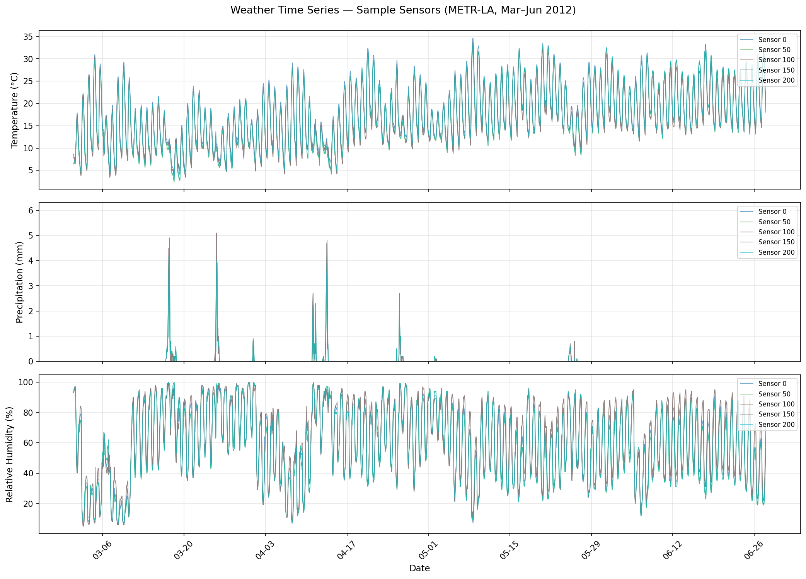
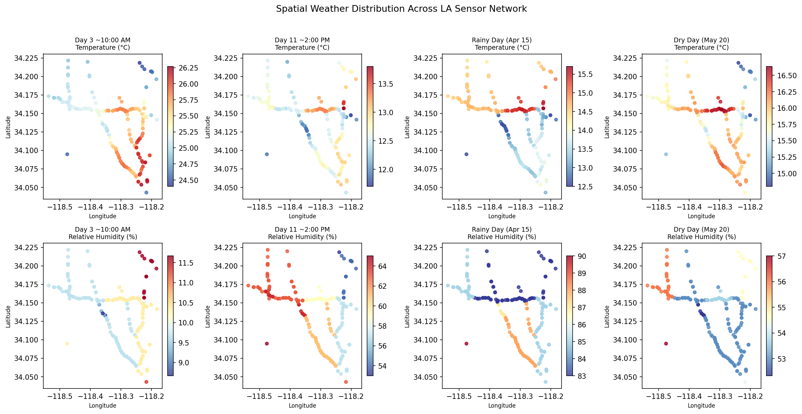
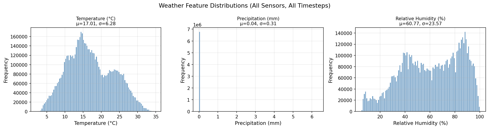
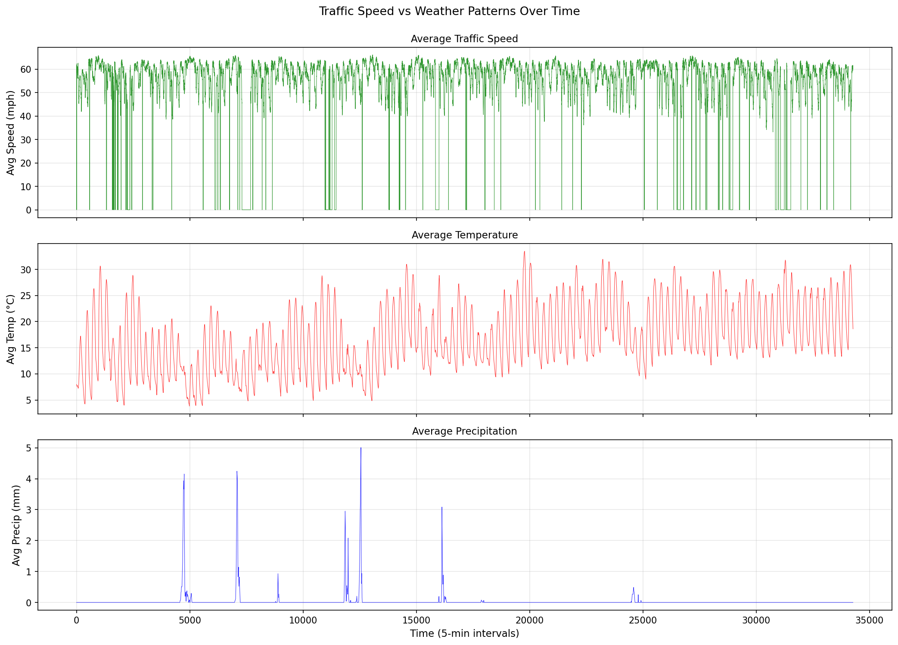
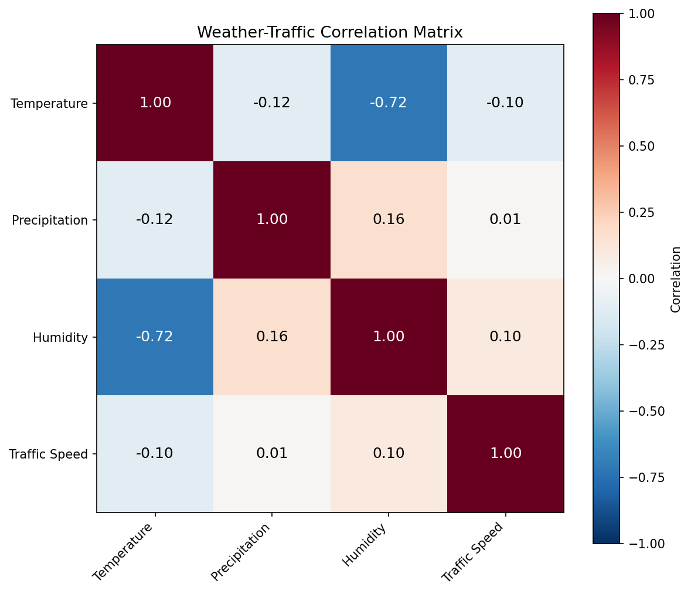

# Graph WaveNet for Deep Spatial-Temporal Graph Modeling

This repository contains the PyTorch implementation of Graph WaveNet for traffic forecasting, extended with contextual METR-LA experiments that add weather and road metadata.

Original paper: [Graph WaveNet for Deep Spatial-Temporal Graph Modeling, IJCAI 2019](https://arxiv.org/abs/1906.00121). A related improvement is presented by Shleifer et al. in their [paper](https://arxiv.org/abs/1912.07390) and [code](https://github.com/sshleifer/Graph-WaveNet).

<p align="center">
  
</p>

## Project Notes

- Final project summary: [`docs/final-project-summary.md`](./docs/final-project-summary.md)
- Local workspace inventory: [`docs/local-workspace-inventory.md`](./docs/local-workspace-inventory.md)
- Experiment history: [`EXPERIMENTS.md`](./EXPERIMENTS.md)

## Requirements

- Python 3.11 or lower
- See `requirements.txt`

## Data Preparation

### Step 1: Download Data

Download METR-LA and PEMS-BAY data from the [Google Drive](https://drive.google.com/open?id=10FOTa6HXPqX8Pf5WRoRwcFnW9BrNZEIX) or [Baidu Yun](https://pan.baidu.com/s/14Yy9isAIZYdU__OYEQGa_g) links provided by [DCRNN](https://github.com/liyaguang/DCRNN).

### Step 2: Process Raw Data

```bash
# Create data directories
mkdir -p data/{METR-LA,PEMS-BAY}

# METR-LA
python generate_training_data.py --output_dir=data/METR-LA --traffic_df_filename=data/metr-la.h5

# PEMS-BAY
python generate_training_data.py --output_dir=data/PEMS-BAY --traffic_df_filename=data/pems-bay.h5
```

## Train Commands

```bash
python train.py --gcn_bool --adjtype doubletransition --addaptadj --randomadj
```

For contextual runs, see the run notes in [`EXPERIMENTS.md`](./EXPERIMENTS.md).

## Experiment Tracking

Every model run should be logged in [`EXPERIMENTS.md`](./EXPERIMENTS.md). This keeps a permanent record of:

- What was tried
- Hyperparameters used
- Final scores (MAE, MAPE, RMSE) for each horizon
- Whether it worked, failed, or is in progress

### Current Best Result

| Model | Avg MAE | Avg MAPE | Avg RMSE | MAE@60min | MAPE@60min | Notes |
|-------|---------|----------|----------|-----------|------------|-------|
| Graph WaveNet + GCN road injection | 3.06 | 8.21% | 6.09 | 3.53 | 9.88% | Best average MAPE; static road features injected at GCN level |

## Weather Data Visualizations

Historical weather data (temperature, precipitation, humidity) for all 207 METR-LA sensors was fetched via the [Open-Meteo API](https://open-meteo.com/) and interpolated to 5-minute intervals. The plots below are generated by `visualize_weather.py`.

### Time Series: Sample Sensors



### Spatial Distribution Across LA



### Feature Distributions



### Traffic Speed vs Weather Over Time



### Weather-Traffic Correlation Matrix



Key insight: precipitation shows almost no linear correlation with average traffic speed (+0.01), which suggests weather is more useful for identifying anomalous conditions than explaining everyday congestion.
